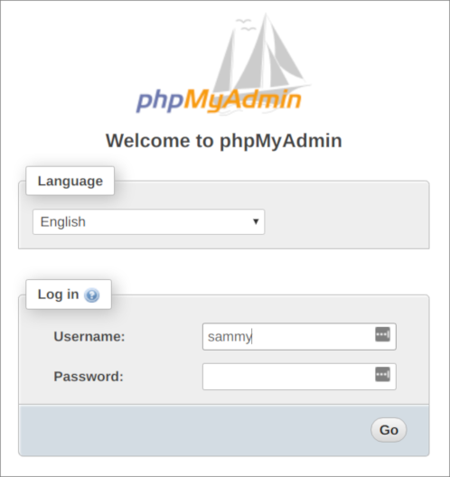
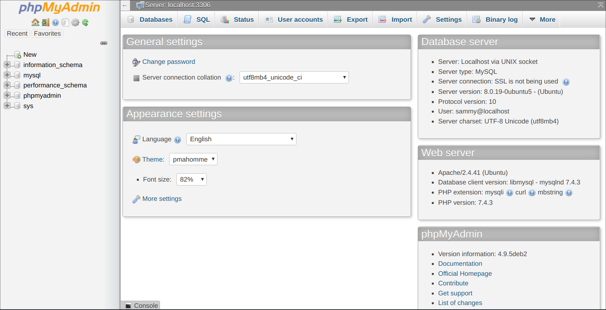

# Introduction
MySQL is an open-source database management software that helps users store, organize, and later retrieve data. It has a variety of options to grant specific users nuanced permissions within the tables and databases—this tutorial will give a short overview of a few of the many options.

## Installation
### Step 1 — Installing MySQL
On Ubuntu 20.04, you can install MySQL using the APT package repository. At the time of this writing, the version of MySQL available in the default Ubuntu repository is version 8.0.19.

To install it, update the package index on your server if you’ve not done so recently:

    sudo apt update
 
Then install the mysql-server package:

    sudo apt install mysql-server
 
This will install MySQL, but will not prompt you to set a password or make any other configuration changes. Because this leaves your installation of MySQL insecure, we will address this next.

### Step 2 — Installing phpMyAdmin
Please note, though, that the installation process requires you to make some choices to configure phpMyAdmin correctly. We’ll walk through these options shortly:

    sudo apt install phpmyadmin php-mbstring php-zip php-gd php-json php-curl

Here are the options you should choose when prompted in order to configure your installation correctly:

For the server selection, choose `apache2`

**Warning:** When the prompt appears, “apache2” is highlighted, but not selected.

If you do not hit `SPACE` to select Apache, the installer will not move the necessary files during installation. Hit `SPACE`, `TAB`, and then `ENTER` to select Apache.

Select `Yes` when asked whether to use dbconfig-common to set up the database

You will then be asked to choose and confirm a MySQL application password for phpMyAdmin

The installation process adds the phpMyAdmin Apache configuration file into the `/etc/apache2/conf-enabled/` directory, where it is read automatically. To finish configuring Apache and PHP to work with phpMyAdmin, the only remaining task in this section of the tutorial is to is explicitly enable the mbstring PHP extension, which you can do by typing:

    sudo phpenmod mbstring
 
Afterwards, restart Apache for your changes to be recognized:

    sudo systemctl restart apache2
 
phpMyAdmin is now installed and configured to work with Apache. However, before you can log in and begin interacting with your MySQL databases, you will need to ensure that your MySQL users have the privileges required for interacting with the program.

### Step 3 — Configure phpMyAdmin and user privileges

When you installed phpMyAdmin onto your server, it automatically created a database user called phpmyadmin which performs certain underlying processes for the program. Rather than logging in as this user with the administrative password you set during installation, it’s recommended that you log in as either your root MySQL user or as a user dedicated to managing databases through the phpMyAdmin interface.

Configuring Password Access for the MySQL Root Account

In Ubuntu systems running MySQL 5.7 (and later versions), the root MySQL user is set to authenticate using the auth_socket plugin by default rather than with a password. This allows for some greater security and usability in many cases, but it can also complicate things when you need to allow an external program — like phpMyAdmin — to access the user.

In order to log in to phpMyAdmin as your root MySQL user, you will need to switch its authentication method from auth_socket to one that makes use of a password, if you haven’t already done so. To do this, open up the MySQL prompt from your terminal:

    sudo mysql
 
Next, check which authentication method each of your MySQL user accounts use with the following command:

    mysql> SELECT user,authentication_string,plugin,host FROM mysql.user;
 
In this example, you can see that the root user does in fact authenticate using the auth_socket plugin. To configure the root account to authenticate with a password, run the following ALTER USER command. Be sure to change password to a strong password of your choosing:

    mysql> ALTER USER 'root'@'localhost' IDENTIFIED WITH caching_sha2_password BY 'password';
 
*Note: The previous ALTER USER statement sets the root MySQL user to authenticate with the caching_sha2_password plugin. Per the official MySQL documentation, caching_sha2_password is MySQL’s preferred authentication plugin, as it provides more secure password encryption than the older, but still widely used, mysql_native_password.*

*However, some versions of PHP don’t work reliably with caching_sha2_password. PHP has reported that this issue was fixed as of PHP 7.4, but if you encounter an error when trying to log in to phpMyAdmin later on, you may want to set root to authenticate with mysql_native_password instead:*

    mysql> ALTER USER 'root'@'localhost' IDENTIFIED WITH mysql_native_password BY 'password';
 
Then, check the authentication methods employed by each of your users again to confirm that root no longer authenticates using the auth_socket plugin:

    mysql> SELECT user,authentication_string,plugin,host FROM mysql.user;
 
You can see from this output that the root user will authenticate using a password. You can now log in to the phpMyAdmin interface as your root user with the password you’ve set for it here.
&nbsp;

#### Configuring Password Access for a Dedicated MySQL User

Alternatively, some may find that it better suits their workflow to connect to phpMyAdmin with a dedicated user. To do this, open up the MySQL shell once again:

    sudo mysql -u root -p
 
From there, create a new user and give it a strong password:

    mysql> CREATE USER 'sammy'@'localhost' IDENTIFIED WITH caching_sha2_password BY 'password';
 
*Note: Again, depending on what version of PHP you have installed, you may want to set your new user to authenticate with mysql_native_password instead of caching_sha2_password:*

    mysql> ALTER USER 'sammy'@'localhost' IDENTIFIED WITH mysql_native_password BY 'password';
 
Then, grant your new user appropriate privileges. For example, you could grant the user privileges to all tables within the database, as well as the power to add, change, and remove user privileges, with this command:

    mysql> GRANT ALL PRIVILEGES ON *.* TO 'sammy'@'localhost' WITH GRANT OPTION;
 
Following that, exit the MySQL shell:

    mysql> exit
 
You can now access the web interface by visiting your server’s domain name or public IP address followed by /phpmyadmin:

https://localhost:8000/phpmyadmin

Log in to the interface, either as root or with the new username and password you just configured.

When you log in, you’ll see the user interface, which will look something like this:

Now that you’re able to connect and interact with phpMyAdmin, all that’s left to do is harden your system’s security to protect it from attackers.

### Step 3 — Configuring MySQL
For fresh installations of MySQL, you’ll want to run the DBMS’s included security script. This script changes some of the less secure default options for things like remote root logins and sample users.

Run the security script with sudo:

    sudo mysql_secure_installation
 
This will take you through a series of prompts where you can make some changes to your MySQL installation’s security options. The first prompt will ask whether you’d like to set up the Validate Password Plugin, which can be used to test the password strength of new MySQL users before deeming them valid.

If you elect to set up the Validate Password Plugin, any MySQL user you create that authenticates with a password will be required to have a password that satisfies the policy you select. The strongest policy level — which you can select by entering 2 — will require passwords to be at least eight characters long and include a mix of uppercase, lowercase, numeric, and special characters:

    Output
    Securing the MySQL server deployment.

    Connecting to MySQL using a blank password.

    VALIDATE PASSWORD COMPONENT can be used to test passwords
    and improve security. It checks the strength of password
    and allows the users to set only those passwords which are
    secure enough. Would you like to setup VALIDATE PASSWORD component?

    Press y|Y for Yes, any other key for No: Y

    There are three levels of password validation policy:

    LOW    Length >= 8
    MEDIUM Length >= 8, numeric, mixed case, and special characters
    STRONG Length >= 8, numeric, mixed case, special characters and dictionary                  file

    Please enter 0 = LOW, 1 = MEDIUM and 2 = STRONG:
    2
Regardless of whether you choose to set up the Validate Password Plugin, the next prompt will be to set a password for the MySQL root user. Enter and then confirm a secure password of your choice:

    Output
    Please set the password for root here.

    New password: 

    Re-enter new password: 
Note that even though you’ve set a password for the root MySQL user, this user is not currently configured to authenticate with a password when connecting to the MySQL shell.

Once the script completes, your MySQL installation will be secured. You can now move on to creating a dedicated database user with the MySQL client.

## How to Create a New User

In Part 1 of the MySQL Tutorial, we did all of the editing in MySQL as the root user, with full access to all of the databases. However, in cases where more restrictions may be required, there are ways to create users with custom permissions.

Let’s start by making a new user within the MySQL shell:

    CREATE USER 'newuser'@'localhost' IDENTIFIED WITH authentication_plugin BY 'password';
 
*Note: When adding users within the MySQL shell, we will specify the user’s host as localhost and not the server’s IP address. localhost is a hostname which means “this computer,” and MySQL treats this particular hostname specially: when a user with that host logs into MySQL it will attempt to connect to the local server by using a Unix socket file. Thus, localhost is typically used when you plan to connect by SSHing into your server or when you’re running the local mysql client to connect to the local MySQL server.*

At this point newuser has no permissions to do anything with the databases. In fact, even if newuser tries to login (with the password, password), they will not be able to reach the MySQL shell.

Therefore, the first thing to do is to provide the user with access to the information they will need.

    GRANT ALL PRIVILEGES ON *.* TO 'newuser'@'localhost';
 
The asterisks in this command refer to the database and table (respectively) that they can access—this specific command allows to the user to read, edit, execute and perform all tasks across all the databases and tables.

Please note that in this example we are granting newuser full root access to everything in our database. While this is helpful for explaining some MySQL concepts, it may be impractical for most use cases and could put your database’s security at high risk.

Once you have finalized the permissions that you want to set up for your new users, always be sure to reload all the privileges.

    FLUSH PRIVILEGES;
 
Your changes will now be in effect.

## How To Grant Different User Permissions
Here is a short list of other common possible permissions that users can enjoy.

    ALL PRIVILEGES- as we saw previously, this would allow a MySQL user full access to a designated database (or if no database is selected, global access across the system)
    CREATE- allows them to create new tables or databases
    DROP- allows them to them to delete tables or databases
    DELETE- allows them to delete rows from tables
    INSERT- allows them to insert rows into tables
    SELECT- allows them to use the SELECT command to read through databases
    UPDATE- allow them to update table rows
    GRANT OPTION- allows them to grant or remove other users’ privileges

To provide a specific user with a permission, you can use this framework:

    GRANT type_of_permission ON database_name.table_name TO 'username'@'localhost';
 
If you want to give them access to any database or to any table, make sure to put an asterisk (*) in the place of the database name or table name.

Each time you update or change a permission be sure to use the Flush Privileges command.

If you need to revoke a permission, the structure is almost identical to granting it:

    REVOKE type_of_permission ON database_name.table_name FROM 'username'@'localhost';
 
Note that when revoking permissions, the syntax requires that you use FROM, instead of TO as we used when granting permissions.

You can review a user’s current permissions by running the following:

    SHOW GRANTS FOR 'username'@'localhost';
 
Just as you can delete databases with DROP, you can use DROP to delete a user altogether:

    DROP USER 'username'@'localhost';
 
To test out your new user, log out by typing:

    quit
 
and log back in with this command in terminal:

    mysql -u [username] -p
 
## Conclusion
After completing this short introduction to MySQL, you should have a sense of how to add new users and grant them a variety of permissions in a MySQL database. From here, you could continue to explore and experiment with different permissions settings for your database, or you may want to learn more about some higher-level MySQL configurations.

Moreover, if mysql interface is a trouble for you, you should now have phpMyAdmin configured and ready to use on your Linux server. Using this interface, you can create databases, users, and tables, as well as perform the usual operations like deleting and modifying structures and data.